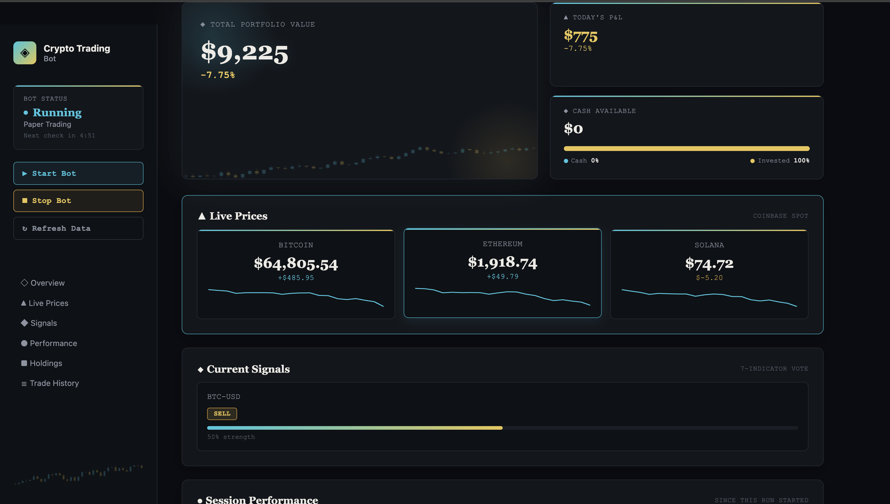
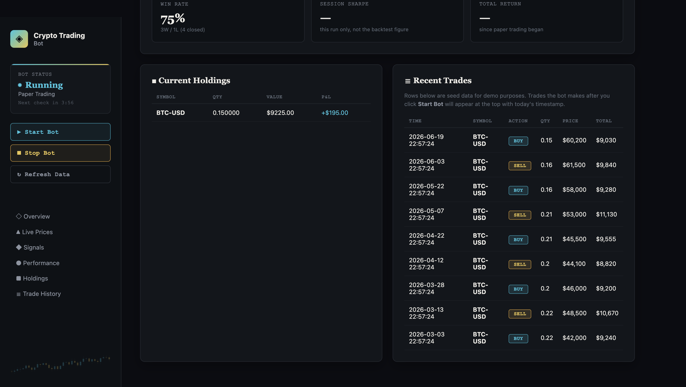

<div align="center">


[](https://www.python.org/downloads/)
[](https://flask.palletsprojects.com/)
[](../LICENSE)
[]()

</div>

An automated cryptocurrency trading platform that uses technical analysis and risk management to generate and execute trades. Includes a real-time web dashboard, a paper trading mode, and a full backtesting engine. This module is the foundation that [ChainProof's verification layer](../verification-layer/) builds on.


## Contents

- [Performance Highlights](#performance-highlights)
- [Features](#features)
- [Architecture](#architecture)
- [Quick Start](#quick-start)
- [Technical Indicators](#technical-indicators)
- [Trading Strategy](#trading-strategy)
- [Backtesting Results](#backtesting-results)
- [Database Schema](#database-schema)
- [API Endpoints](#api-endpoints)
- [Configuration](#configuration)
- [Deployment](#deployment)
- [Testing](#testing)
- [Project Structure](#project-structure)
- [Tech Stack](#tech-stack)


## Screenshots

<div align="center">

**Live dashboard — real-time prices, current signal, session performance**



<br/><br/>

**Holdings and trade history**



</div>


## Performance Highlights

<div align="center">

| Metric | Value |
|:---|:---:|
| Backtested Return (BTC-USD) | **+40.38%** |
| Win Rate | **41.67%** |
| Sharpe Ratio | **0.64** |
| Max Drawdown | **-20.95%** |
| Historical Records Analyzed | **2,196+** |

</div>


## Features

<table>
<tr>
<td valign="top" width="25%">

**Trading Engine**
- 7 technical indicators
- Majority-vote signal generation
- Risk management (3% stop loss, 20% take profit)
- Paper trading mode
- Live trading via CCXT (100+ exchanges)
- Position sizing & portfolio management

</td>
<td valign="top" width="25%">

**Analytics & Optimization**
- 2+ years of historical data, multiple assets
- On-chain analytics (network data, sentiment)
- Walk-forward & out-of-sample backtesting
- Grid search parameter optimization
- Multi-crypto support (BTC, ETH, SOL)

</td>
<td valign="top" width="25%">

**Dashboard & Monitoring**
- Real-time dashboard (Flask + vanilla JS)
- Live P&L, holdings, and trade history
- Auto-updating charts (5s refresh)
- Bot start/stop controls
- Automated health checks & alerts

</td>
<td valign="top" width="25%">

**Deployment**
- Heroku-ready configuration
- Docker support
- Secure environment-based credentials
- Built for 24/7 operation

</td>
</tr>
</table>


## Architecture

```
                    Web Dashboard (Frontend)
              HTML5 + CSS3 + Vanilla JavaScript
        Real-time portfolio display, interactive controls,
                 auto-updating every 5 seconds
                            |
                    REST API (HTTP/JSON)
                            |
                     Flask API Server
      /api/portfolio  /api/trades  /api/prices
      /api/bot/status  /api/bot/start  /api/bot/stop
                            |
              -----------------------------
              |                           |
      Trading Engine                 Data Layer
      Strategy, indicators,          SQLite, 6 tables,
      risk management, execution     2,196 records
              |                           |
              -----------------------------
                            |
                   External Services
        Yahoo Finance, CoinGecko, CCXT (exchanges)
```


## Quick Start

### Prerequisites
- Python 3.10+
- pip
- Virtual environment (recommended)

### Installation

```bash
git clone https://github.com/Zenish2001/ChainProof.git
cd ChainProof/trading-bot

python3 -m venv venv
source venv/bin/activate  # On Windows: venv\Scripts\activate

pip install -r requirements.txt

cp .env.example .env
# Edit .env with your settings

python data/fetch_historical_data.py
```

### Usage

Run the web dashboard:
```bash
python frontend/app.py
# Open browser to http://localhost:5001
```

Run paper trading (safe mode):
```bash
python trading/paper_trading.py
```

Run strategy optimization:
```bash
python strategies/strategy_optimizer.py
```

Run a health check:
```bash
python monitoring/health_check.py
```


## Technical Indicators

<div align="center">

| Indicator | Configuration | Purpose |
|---|---|---|
| Moving Averages (SMA, EMA) | SMA 20/50/200, EMA 12/26 | Trend direction and momentum |
| RSI | Overbought > 70, oversold < 30 | Market reversal points |
| MACD | 12 EMA − 26 EMA, 9 EMA signal | Trend following and momentum |
| Bollinger Bands | 20-period SMA, ±2 std dev | Volatility and price extremes |
| Stochastic Oscillator | %K / %D, range 0-100 | Overbought/oversold conditions |
| ATR | Average True Range | Position sizing and stop-loss placement |
| OBV | Cumulative volume | Confirms price trends with volume |

</div>


## Trading Strategy

### Signal Generation

A majority-vote system combines all 7 indicators:

```python
buy_votes = count_indicators_saying_buy()
sell_votes = count_indicators_saying_sell()

if buy_votes >= 4:
    signal = 'BUY'
elif sell_votes >= 4:
    signal = 'SELL'
else:
    signal = 'HOLD'
```

### Risk Management

- Position size: 95% of available capital
- Stop loss: 3% (automatic sell if loss exceeds threshold)
- Take profit: 20% (automatic sell when target reached)
- Signal threshold: requires 75% confidence
- Daily loss limit: 10% maximum


## Backtesting Results

<div align="center">

**BTC-USD (optimized parameters)**

| Metric | Value |
|:---|:---:|
| Return | **+40.38%** |
| Win Rate | 41.67% |
| Sharpe Ratio | 0.64 |
| Max Drawdown | -20.95% |
| Trades | 24 |

| Asset | Return | Win Rate | Max Drawdown |
|:---|:---:|:---:|:---:|
| ETH-USD | -6.40% | 41.94% | -27.40% |
| SOL-USD | -34.09% | 39.13% | -50.53% |

</div>

The strategy performs best on Bitcoin, the most stable of the three assets tested.


## Database Schema

**Tables:** `price_history`, `portfolio`, `trades`, `trading_signals`, `blockchain_metrics`, `performance_metrics`

```sql
price_history
├── id (PK)
├── symbol
├── timestamp
├── open, high, low, close
└── volume

portfolio
├── id (PK)
├── symbol
├── quantity
├── avg_buy_price
├── current_price
└── last_updated

trades
├── id (PK)
├── symbol
├── timestamp
├── trade_type (BUY/SELL)
├── quantity
├── price
└── total_value
```


## API Endpoints

| Endpoint | Method | Description |
|---|:---:|---|
| `/api/portfolio` | GET | Portfolio value, cash, P&L, and holdings |
| `/api/trades` | GET | Last 10 trades |
| `/api/prices` | GET | Current prices for BTC, ETH, SOL |
| `/api/bot/status` | GET | Current bot status |
| `/api/bot/start` | POST | Start the bot |
| `/api/bot/stop` | POST | Stop the bot |

**Example response — `GET /api/portfolio`**
```json
{
  "total_value": 10456.78,
  "cash": 2345.67,
  "pnl": 456.78,
  "pnl_percent": 4.57,
  "holdings": {
    "BTC-USD": {
      "quantity": 0.156,
      "current_value": 8234.45,
      "cost_basis": 8000.00
    }
  }
}
```


## Configuration

### Environment Variables

Create a `.env` file:

```bash
LIVE_TRADING=no
TRADING_MODE=PAPER
INITIAL_CAPITAL=10000

COINBASE_API_KEY=your_api_key
COINBASE_API_SECRET=your_api_secret

ALERT_EMAIL=your@email.com
SENDGRID_API_KEY=your_sendgrid_key

TWILIO_ACCOUNT_SID=your_sid
TWILIO_AUTH_TOKEN=your_token
TWILIO_PHONE_NUMBER=+1234567890
ALERT_PHONE=+1234567890
```

### Strategy Parameters

Edit `trading/paper_trading.py`:

```python
CONFIG = {
    'symbols': ['BTC-USD', 'ETH-USD', 'SOL-USD'],
    'initial_capital': 10000,
    'position_size': 0.95,
    'stop_loss': 0.03,
    'take_profit': 0.20,
    'signal_threshold': 0.75,
    'check_interval': 60
}
```


## Deployment

**Heroku**
```bash
brew install heroku
heroku login
heroku create your-trading-bot
heroku config:set LIVE_TRADING=no
heroku config:set TRADING_MODE=PAPER
git push heroku main
heroku ps:scale web=1 worker=1
heroku open
```

**Docker**
```bash
docker-compose build
docker-compose up -d
docker-compose logs -f
docker-compose down
```


## Testing

```bash
# Run backtests
python strategies/trading_strategy.py

# Run strategy optimizer
python strategies/strategy_optimizer.py

# Test paper trading
python trading/paper_trading.py

# Health check
python monitoring/health_check.py
```


## Project Structure

```
trading-bot/
├── data/                    # Data collection & storage
│   ├── database.py
│   ├── price_fetcher.py
│   ├── fetch_historical_data.py
│   └── trading_bot.db
├── indicators/              # Technical analysis
│   └── technical_indicators.py
├── strategies/              # Trading logic
│   ├── trading_strategy.py
│   ├── backtest.py
│   └── strategy_optimizer.py
├── blockchain/              # On-chain analytics
│   └── blockchain_analytics.py
├── trading/                 # Execution
│   ├── paper_trading.py
│   └── live_trading.py
├── frontend/                # Web dashboard
│   ├── app.py
│   ├── templates/
│   │   └── dashboard.html
│   └── static/
│       ├── css/style.css
│       └── js/script.js
├── monitoring/               # Health checks
│   ├── __init__.py
│   └── health_check.py
├── screenshots/              # Dashboard screenshots
│   ├── trading-bot-overview.png
│   └── trading-bot-holdings.png
├── requirements.txt
├── Procfile
├── runtime.txt
├── .env.example
├── .gitignore
└── README.md
```


## Tech Stack

<div align="center">


</div>

<br/>

**Backend:** Python 3.10, Flask, SQLite, Pandas/NumPy, yfinance, TA-Lib, CCXT
**Frontend:** HTML5, CSS3, Vanilla JavaScript, Fetch API
**DevOps:** Git, Heroku, Docker, Gunicorn