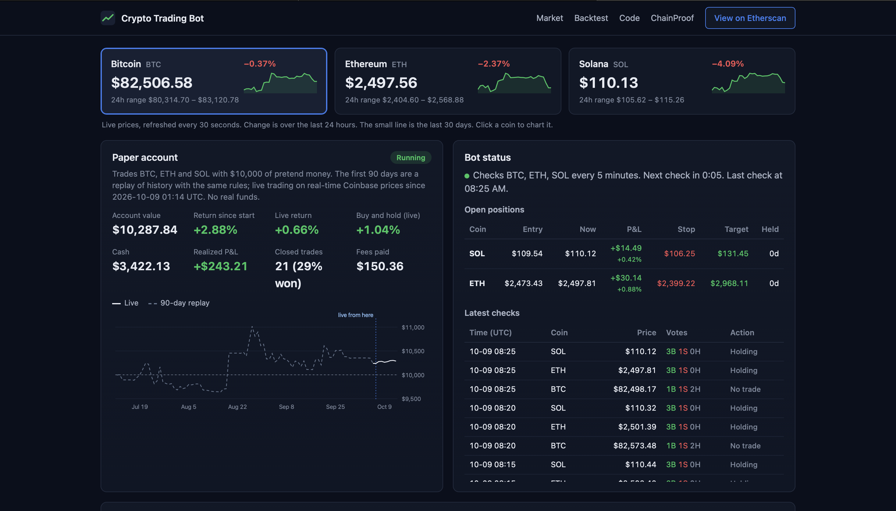

# Paper-Trading Bot

The trading strategy behind [ChainProof](../README.md), running live on Coinbase prices with $10,000 of pretend money. No real funds.

**[Live dashboard](http://18.224.206.193:8081)**



## What it does

- Trades **BTC, ETH and SOL**, each with up to a third of the account.
- Four indicators vote buy, sell or hold on daily candles: **RSI (14)**, **MACD (12, 26, 9)**, an **SMA 20/50** crossover and **Bollinger Bands (20, 2)**. Two matching votes trigger a trade.
- Exits on a sell signal, a **3% stop-loss** or a **20% take-profit**. Every buy and sell pays a **0.1% fee**.
- On first start it replays the **last 90 days** with exactly the same rules, so the account has history. Those trades are marked **Replay**; everything after is **Live**.
- Every check is logged with the price, the votes and what the bot did.

The dashboard shows live BTC/ETH/SOL prices, the account and open positions, candlestick charts with the indicators and the bot's trades, the signal history, and an **interactive backtest** where you choose the position size, stop-loss and take-profit and compare against buy-and-hold.

## Skills shown

| Area | What this project uses |
|---|---|
| Trading logic | RSI, MACD, moving-average crossover, Bollinger Bands, vote-based signals, stop-loss / take-profit, fees |
| Backtesting | Equity curve, win rate, Sharpe ratio, max drawdown, buy-and-hold comparison |
| Backend | Python, pandas, NumPy, Flask, SQLite, background worker thread |
| Data | Coinbase REST API with CoinGecko fallback, caching and retries |
| Frontend | JavaScript, SVG candlestick and indicator charts (no chart library) |
| DevOps | Docker, Gunicorn, AWS EC2 |

## Requirements

- Python 3.10+
- Internet access (prices come from Coinbase's public API, no key needed)
- Optional: Docker

## Run it

```bash
pip install -r requirements-dashboard.txt
python frontend/app.py                      # http://localhost:5001
```

| Setting | Default | Meaning |
|---|---|---|
| `CHECK_INTERVAL` | `300` | Seconds between checks |
| `WARM_START_DAYS` | `90` | Days replayed on first start |
| `ALLOW_CONTROL` | `0` | `1` shows Start/Stop buttons. Keep it off on a public server |
| `AUTOSTART` | `1` | Start the bot with the web server |
| `STATE_DIR` | `data/` | Where the SQLite database and portfolio file live |

To start fresh, delete `data/trading_bot.db` and `data/paper_portfolio.json`.

**Docker** (used for the live dashboard): `docker build -t trading-bot . && docker run -p 8000:8000 -v botstate:/state trading-bot`. Keep a single Gunicorn worker, since the bot runs as a thread inside the web process.

## Code

| Path | Purpose |
|---|---|
| `trading/paper_trading.py` | The bot: signals, orders, stops, fees, warm start, decision log |
| `indicators/technical_indicators.py` | RSI, MACD, SMAs, Bollinger Bands and the vote |
| `strategies/trading_strategy.py` | Backtester used by the dashboard |
| `evaluate_backtest.py` | Fees, buy-and-hold benchmark and out-of-sample test |
| `data/` | SQLite storage and the Coinbase / CoinGecko price client |
| `frontend/` | Flask dashboard |

## API

| Endpoint | Returns |
|---|---|
| `GET /api/state` | Account, positions, trades, decision log, equity history |
| `GET /api/prices` | Live BTC/ETH/SOL prices with 24h change |
| `GET /api/market/<symbol>` | Daily candles with indicators, last 10 days of signals |
| `POST /api/backtest` | Backtest with `symbol`, `position_size`, `stop_loss`, `take_profit` |

Prices come from Coinbase's public API, with CoinGecko as a fallback. No API keys needed.
