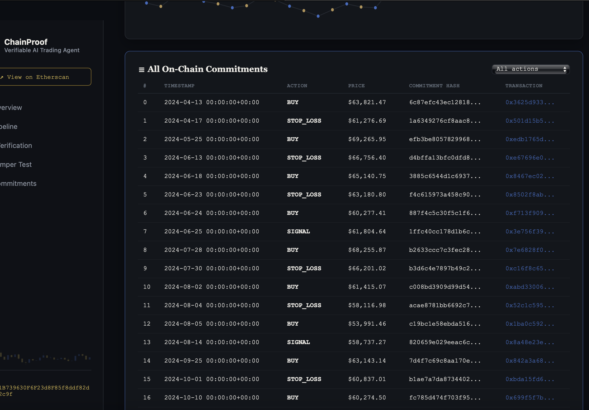

<div align="center">


[]()
[]()
[](https://www.python.org/downloads/)
[](../LICENSE)
[]()

</div>

The ChainProof addition: a smart contract that logs trade-decision commitments on a public testnet, and an independent verifier that re-runs the [trading bot's](../trading-bot/) actual strategy code from scratch to confirm the on-chain record matches what the strategy genuinely produced.

This module doesn't trade anything itself — it proves that decisions made by the trading bot are genuine.


## Contents

- [How It Works](#how-it-works)
- [Results](#results)
- [Scope — What's Real vs. Mocked](#scope--whats-real-vs-mocked)
- [Quick Start](#quick-start)
- [Repository Structure](#repository-structure)
- [Live Dashboard](#live-dashboard)
- [Tech Stack](#tech-stack)


## How It Works

**1. Commit** — `generate_replay_data.py` re-runs the trading bot's unmodified strategy code against real historical BTC-USD price data, using the winning backtest parameters (`position_size=0.95, stop_loss=0.03, take_profit=0.20`). `commit_and_sign.py` then hashes each decision's full input snapshot — price, every indicator value, the decision itself, and the active risk parameters — with `keccak256`, and signs the hash with a dedicated local attestation key.

**2. Log** — `scripts/submit_commitments.js` submits each signed commitment to `ChainProofRegistry.sol`, a minimal Solidity contract deployed to the Ethereum Sepolia testnet. Every submission is a real, individually confirmed on-chain transaction.

**3. Verify** — `verifier.py` independently re-runs the trading bot's strategy code **from scratch** — it does not read any cached file from steps 1–2. It recomputes each commitment hash and pulls the actual on-chain commitments directly from the live contract, then compares them.

**4. Attest** — `tamper_test.py` demonstrates the verifier catching a deliberately falsified decision, by altering one commitment's price and confirming the recomputed hash no longer matches the on-chain record.


## Results

<div align="center">

| Criterion | Result |
|:---|:---:|
| Replayed decisions from real backtest | **30 / 30** genuine, matches known 38.47% return / 0.64 Sharpe |
| Logged on-chain | **30 / 30** confirmed transactions on Sepolia |
| Independently verified | **30 / 30** match |
| Tamper-detection test | **Passed** — deliberately altered decision correctly flagged |
| Contract source | **Verified** on Etherscan |

</div>


## Screenshots

<div align="center">

**Live dashboard — commitment ledger, showing all 30 real on-chain decisions**



</div>


## Scope — What's Real vs. Mocked

**Real:**
- Unmodified strategy code — `technical_indicators.py` and `trading_strategy.py`, unchanged
- Real BTC-USD price history and real backtest results
- Real Sepolia transactions — every commitment is a genuine on-chain event
- Real independent re-execution — the verifier re-runs the strategy from scratch, it does not trust cached files

**Mocked, stated explicitly:**
- Attestation is a signed hash from a local key, standing in for full hardware TEE attestation
- No live trading — this replays existing backtested history, it does not place new trades
- No access control beyond none — this is a personal verification log, not a multi-party system


## Quick Start

```bash
# Install dependencies
npm install --legacy-peer-deps
pip install web3 eth-account --break-system-packages

# Set up environment (never commit this file)
cat > .env << EOF
SEPOLIA_RPC_URL=your_alchemy_sepolia_url
PRIVATE_KEY=your_wallet_private_key
ETHERSCAN_API_KEY=your_etherscan_api_key
EOF

# Compile and deploy the contract
npx hardhat compile
npx hardhat run scripts/deploy.js --network sepolia

# Verify the contract on Etherscan
npx hardhat verify --network sepolia YOUR_CONTRACT_ADDRESS

# Generate the real replay dataset from the actual backtest
python generate_replay_data.py

# Hash and sign each decision
python commit_and_sign.py

# Submit all commitments on-chain (set CONTRACT_ADDRESS in the script first)
npx hardhat run scripts/submit_commitments.js --network sepolia

# Independently verify everything from scratch
python verifier.py

# Run the tamper-detection test
python tamper_test.py

# Launch the live results dashboard
cd dashboard && python dashboard_app.py
```


## Repository Structure

```
verification-layer/
├── contracts/
│   └── ChainProofRegistry.sol      # Minimal on-chain commitment registry
├── scripts/
│   ├── deploy.js                    # Deploys the contract to Sepolia
│   └── submit_commitments.js        # Submits signed commitments on-chain
├── dashboard/
│   ├── dashboard_app.py             # Flask backend, reuses verifier.py directly
│   ├── templates/
│   └── static/
├── results/
│   ├── strategy_comparison.csv      # Real optimizer output (backtest source of truth)
│   ├── chainproof_replay_decisions.csv
│   ├── chainproof_commitments.csv
│   └── chainproof_onchain_log.csv
├── generate_replay_data.py          # Step 1: real replay dataset from the actual backtest
├── commit_and_sign.py               # Step 1: hash + sign each decision
├── verifier.py                      # Step 3: independent re-verification
├── tamper_test.py                   # Step 4: tamper-detection demonstration
└── hardhat.config.js
```


## Live Dashboard

A Flask dashboard (`dashboard/`) presents all of the above interactively:

- Real backtest stats and the Commit → Log → Verify → Attest pipeline
- A **live "Run Verification" button** — triggers a genuine independent re-execution against the deployed contract, not a cached result
- A **live "Run Tamper Test" button** — demonstrates falsification detection on demand
- A price chart across all 30 committed decisions
- The full on-chain commitment ledger, with direct links to each transaction on Etherscan

Run it with `python dashboard/dashboard_app.py`, then open `http://localhost:5002`.


## Tech Stack

<div align="center">


</div>

**Contract & deployment:** Solidity, Hardhat, Ethereum Sepolia testnet
**Verification scripts:** Python, `web3.py`, `eth-account`, `keccak256`
**Dashboard:** Flask, vanilla JS, inline SVG charts

<br/>

<div align="center">

</div>
