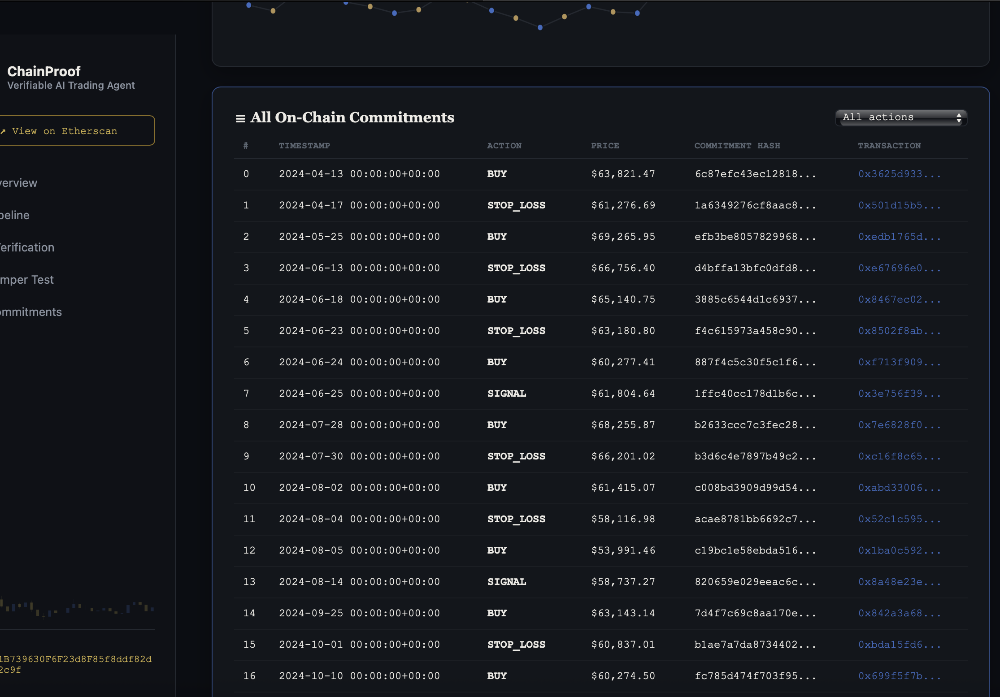

<div align="center">


[]()
[]()
[](https://www.python.org/downloads/)
[](../LICENSE)
[]()

</div>

The ChainProof addition: a smart contract that logs trade-decision commitments on a public testnet, and an independent verifier that recomputes every commitment from the published decisions of the [trading bot](../trading-bot/) and checks it, and its signature, against the on-chain record.

This module doesn't trade anything itself — it proves that decisions made by the trading bot are genuine.


## Contents

- [How It Works](#how-it-works)
- [Results](#results)
- [Screenshots](#screenshots)
- [Scope — What's Real vs. Mocked](#scope--whats-real-vs-mocked)
- [Quick Start](#quick-start)
- [Repository Structure](#repository-structure)
- [Live Dashboard](#live-dashboard)
- [Tech Stack](#tech-stack)


## How It Works

**1. Commit** — `generate_replay_data.py` re-runs the trading bot's unmodified strategy code against real historical BTC-USD price data, using the winning backtest parameters (`position_size=0.95, stop_loss=0.03, take_profit=0.20`). `commit_and_sign.py` then hashes each decision's full input snapshot — price, each voting indicator's signal, the decision itself, and the active risk parameters — with `keccak256`, and signs the hash with a dedicated local attestation key.

**2. Log** — `scripts/submit_commitments.js` submits each signed commitment to `ChainProofRegistry.sol`, a minimal Solidity contract deployed to the Ethereum Sepolia testnet. Every submission is a real, individually confirmed on-chain transaction.

**3. Verify** — `verify.py` reads the 30 published decisions from `results/`, rebuilds each canonical payload, recomputes its `keccak256` hash, and compares it against the commitment pulled directly from the live contract. It also recovers the signer of every commitment and requires it to match the ChainProof attestation address, since the registry itself stores signatures without checking them. It does not re-run the strategy from raw prices — the price database is not yet in this repository.

**4. Tamper test** — `tamper_test.py` reuses `verify.py`'s functions to check one decision three ways: genuine (matches), price moved by $500 (rejected), and one indicator signal flipped (rejected).


## Results

<div align="center">

| Criterion | Result |
|:---|:---:|
| Replayed decisions from real backtest | **30 / 30** genuine, matches known 38.47% return / 0.64 Sharpe |
| Logged on-chain | **30 / 30** confirmed transactions on Sepolia |
| Independently verified | **30 / 30** hashes match, **30 / 30** signatures valid |
| Tamper-detection test | **Passed** — deliberately altered decision correctly flagged |
| Contract source | **Verified** on Etherscan |

</div>


## Screenshots

<div align="center">

**Live dashboard — commitment ledger, showing all 30 real on-chain decisions**



</div>


## Scope — What's Real vs. Mocked

**Real:**
- Unmodified strategy code — `technical_indicators.py` and `trading_strategy.py`, unchanged
- Real BTC-USD price history and real backtest results
- Real Sepolia transactions — every commitment is a genuine on-chain event
- Independent verification from a clean clone — no keys, no configuration, only the published data and the public chain

**Mocked, stated explicitly:**
- Attestation is a signed hash from a local key, standing in for full hardware TEE attestation
- No live trading — this replays existing backtested history, it does not place new trades
- No access control beyond none — this is a personal verification log, not a multi-party system


## Quick Start

```bash
npm install --legacy-peer-deps
pip install -r requirements.txt

npx hardhat compile
npx hardhat run scripts/deploy.js --network sepolia
npx hardhat verify --network sepolia YOUR_CONTRACT_ADDRESS

# Steps below re-create the commitments from scratch. generate_replay_data.py
# needs the price database, which is not yet in this repository, and
# commit_and_sign.py creates a NEW attestation key if none exists.
python generate_replay_data.py
python commit_and_sign.py
npx hardhat run scripts/submit_commitments.js --network sepolia

# Verification only needs this:
python verify.py
python tamper_test.py

# Re-run the strategy from raw prices (after export_price_fixture.py has
# written fixtures/BTC-USD.csv on the machine with the database):
python replay_check.py

python dashboard/dashboard_app.py
```


## Repository Structure

```
verification-layer/
├── contracts/
│   └── ChainProofRegistry.sol
├── scripts/
│   ├── deploy.js
│   └── submit_commitments.js
├── dashboard/
│   ├── dashboard_app.py
│   ├── templates/
│   └── static/
├── results/
│   ├── strategy_comparison.csv
│   ├── chainproof_replay_decisions.csv
│   ├── chainproof_commitments.csv
│   └── chainproof_onchain_log.csv
├── screenshots/
│   └── chainproof-dashboard.png
├── generate_replay_data.py
├── commit_and_sign.py
├── verify.py
├── replay_check.py
├── export_price_fixture.py
├── tamper_test.py
└── hardhat.config.js
```


## Live Dashboard

A Flask dashboard (`dashboard/`) presents all of the above interactively:

- Real backtest stats and the Commit → Log → Verify → Attest pipeline
- A live "Run Verification" button — runs the same checks as verify.py live against the deployed contract, not a cached result
- A live "Run Tamper Test" button — demonstrates falsification detection on demand
- A price chart across all 30 committed decisions
- The full on-chain commitment ledger, with direct links to each transaction on Etherscan

Run it with `python dashboard/dashboard_app.py`, then open `http://localhost:5002`.


## Tech Stack

<div align="center">


</div>

**Contract & deployment:** Solidity, Hardhat, Ethereum Sepolia testnet
**Verification scripts:** Python, `web3.py`, `eth-account`, `keccak256`
**Dashboard:** Flask, vanilla JS, inline SVG charts

<br/>

<div align="center">

</div>