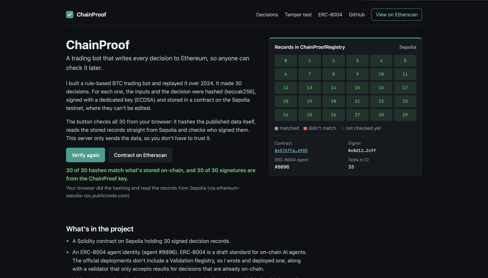

# Verification Layer

The part of [ChainProof](../README.md) that records the trading bot's decisions on Ethereum and lets anyone check them. It doesn't trade; it proves the published decisions are the real ones.

**[Live dashboard](http://18.224.206.193)** · **[ChainProofRegistry on Etherscan](https://sepolia.etherscan.io/address/0x57AfFe0184Bb5A9EfcaEe523b77D17880948A955)**



## How it works

1. **Replay.** `generate_replay_data.py` runs the bot's unmodified strategy over real BTC-USD history with the chosen parameters (`position_size=0.95`, `stop_loss=0.03`, `take_profit=0.20`).
2. **Commit and sign.** `commit_and_sign.py` writes each decision (price, each indicator's vote, the decision and the risk rules) as sorted JSON, hashes it with keccak256 and signs the hash with a dedicated key.
3. **Record.** `scripts/submit_commitments.js` sends each signed hash to `ChainProofRegistry.sol` on Sepolia: 30 confirmed transactions.
4. **Verify.** `verify.py` rebuilds every hash from the published data, compares it with the contract and recovers each signer. The registry stores signatures without checking them, so the verifier does.
5. **Tamper test.** `tamper_test.py` checks one decision three ways: unchanged (passes), price moved by $500 (fails), one vote flipped (fails).

## Results

| Check | Result |
|---|---|
| Decisions recorded on Sepolia | 30 / 30 confirmed transactions |
| Hashes match the chain | 30 / 30 |
| Signatures from the ChainProof key | 30 / 30 |
| Tampered decision detected | Yes |
| Contract source | Verified on Etherscan |

## Requirements

- Python 3.10+ (verification and dashboard)
- Node.js 18+ and npm (only to redeploy the contract or resubmit commitments)
- No keys or wallet needed to verify

## Run it

```bash
pip install -r requirements.txt

python verify.py            # 30/30 hashes and signatures
python tamper_test.py       # shows a changed decision being caught

pip install flask
python dashboard/dashboard_app.py   # http://localhost:5002
```

The dashboard sends only the published data. The visitor's browser hashes it with ethers.js, reads the records from Sepolia itself and recovers the signers, so it doesn't rely on trusting the server. It also has a tamper test where you can edit any field of a decision.

<details>
<summary>Recreate everything from scratch</summary>

```bash
npm install --legacy-peer-deps
npx hardhat compile
npx hardhat run scripts/deploy.js --network sepolia
npx hardhat verify --network sepolia YOUR_CONTRACT_ADDRESS

python generate_replay_data.py      # needs the price database (not in this repo yet)
python commit_and_sign.py           # creates a NEW signing key if none exists
npx hardhat run scripts/submit_commitments.js --network sepolia
python replay_check.py              # re-runs the strategy from fixtures/BTC-USD.csv
```
</details>

## What's real and what's simplified

**Real:** the unmodified strategy code, real BTC-USD prices and backtest, real Sepolia transactions, and verification from a clean clone with only public data.

**Simplified:** the signing key is a local key standing in for hardware attestation, the 30 decisions are a replay of history rather than live trades, and the registry has no access control (it's a personal log).

## Files

| Path | Purpose |
|---|---|
| `contracts/ChainProofRegistry.sol` | Stores each hash, action, timestamp, signer and signature |
| `verify.py`, `tamper_test.py`, `replay_check.py` | Verification tools |
| `generate_replay_data.py`, `commit_and_sign.py` | Create and sign the commitments |
| `scripts/` | Deploy the contract and submit commitments |
| `results/` | Published decisions, commitments, on-chain log and the parameter sweep |
| `dashboard/` | The verification dashboard (Flask + ethers.js) |

## Skills shown

Solidity · Hardhat · keccak256 and ECDSA (EIP-191) · Web3.py · ethers.js · Flask · Docker
